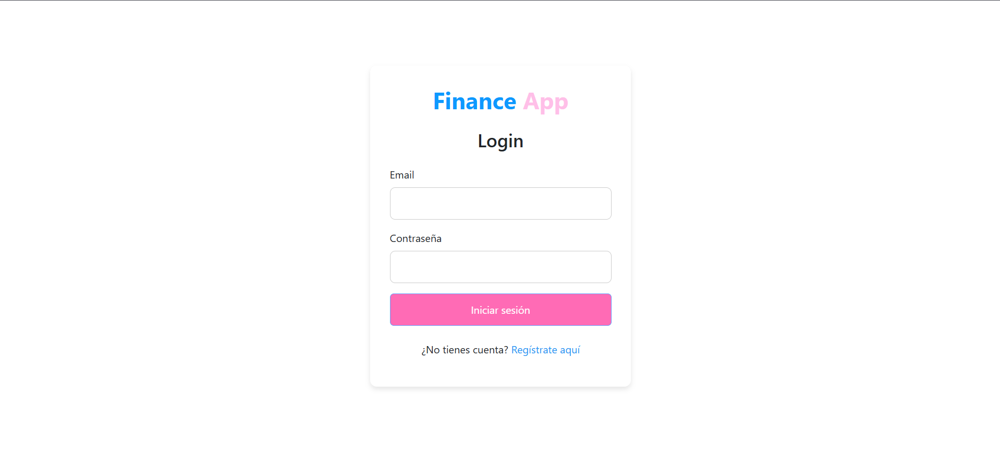
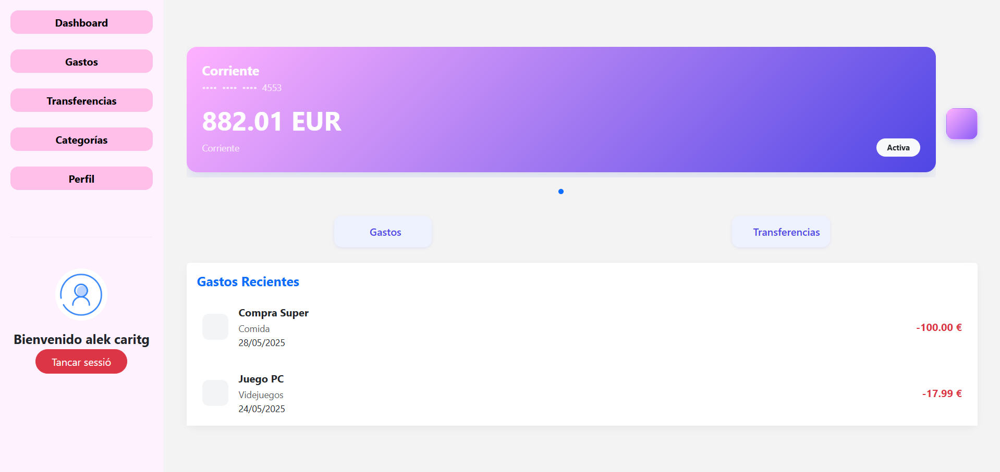

# Finance App - Gestor de Finanzas

[](https://nodejs.org/) 
[](https://expressjs.com/) 
[](https://www.mysql.com/) 
[](https://angular.io/) 
[](https://getbootstrap.com/)

---

## 🚀 Descripción

**Finance App** es una aplicación web para la gestión personal de finanzas. Permite a los usuarios registrarse, iniciar sesión y visualizar un dashboard con un resumen financiero personalizado.

El backend está desarrollado con **Node.js** y **Express**, utilizando una base de datos **MySQL** y asegurando la autenticación mediante **JWT** y encriptación de contraseñas.

El frontend está construido con **Angular**, brindando una interfaz moderna, responsiva y segura, con validación de formularios y protección de rutas.

---

## 🛠 Tecnologías utilizadas

| Backend                   | Frontend           |
|--------------------------|--------------------|
| Node.js                  | Angular            |
| Express.js               | Bootstrap          |
| MySQL                    |                    |
| bcryptjs (encriptación)  |                    |
| JSON Web Tokens (JWT)    |                    |

---

## 📸 Capturas de pantalla

<div align="center">

| Login                              | Dashboard                          |
|-----------------------------------|----------------------------------|
|  |  |

</div>

---

## ⚙️ Estado del proyecto

El proyecto se encuentra **terminado**, aunque puede contener errores menores y funcionalidades pendientes que se implementarán en futuras versiones.

---

## 📦 Instalación y ejecución

### Backend

1. Configura la base de datos MySQL:

   - Importa el script SQL para crear la base de datos y tablas:

     ```bash
     mysql -u tu_usuario -p < Database/Finance-App.sql
     ```

2. Instala las dependencias:

   ```bash
   cd backend
   npm install
